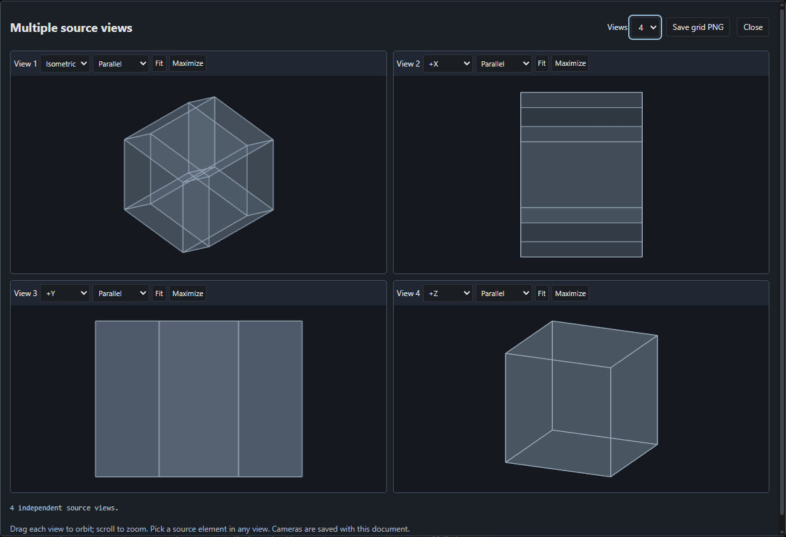

# Polytope Laboratory

Free, open-source desktop tools for constructing, viewing and printing 3D/4D polytopes. The program runs offline and is licensed under [GPLv3](LICENSE).

[Download v0.26 for Windows x64](https://github.com/Pardesco/polytope-laboratory/releases/download/v0.26.0/Polytope.Laboratory.0.26.0.preview.exe) | [Matching source ZIP](https://github.com/Pardesco/polytope-laboratory/releases/download/v0.26.0/Polytope.Laboratory.0.26.0.source.zip) | [Report an issue](https://github.com/Pardesco/polytope-laboratory/issues)



Browse 1305 catalog entries, build models, inspect intrinsic measurements and symmetry, create sections and vertex figures, work with duals and compounds, arrange printable nets, and export images or animations. Native projects retain documents, history, notes, units and source-owned text/PNG. Press F1 for the bundled searchable guide.

The 0.26 preview adds ordinary 4D cell sections and content, dual-morph ratio animation/video, export-frame fitting, coincident-edge assemblies, projective infinite duals, snub reflections, generalized density and algebraic measures, 4D regiment comparisons, and concave-face distances. See [release features and limits](docs/RELEASE_0.26_PREVIEW.md), [nine runnable examples](examples/README.md), and the [feature roadmap](docs/OPEN_SOURCE_ROADMAP.md).

This is an early community preview. Many workflows have bounded geometry domains, and complete Stella4D parity has not been established. Bug reports and contributions are welcome; attach a native project and steps to reproduce. Third-party notices and source provenance remain included.

## Run from source

Install Node.js and Python with versions compatible with the lockfile and requirements, then run on Windows:

```powershell
python -m pip install -r requirements.txt
npm.cmd ci
npm.cmd run build
npm.cmd start
```

The Windows portable bundles Python and its mathematical dependencies. To build a portable from source, run `npm.cmd run package:preview`. See [contributing](CONTRIBUTING.md) and [third-party notices](THIRD_PARTY_NOTICES.md).
