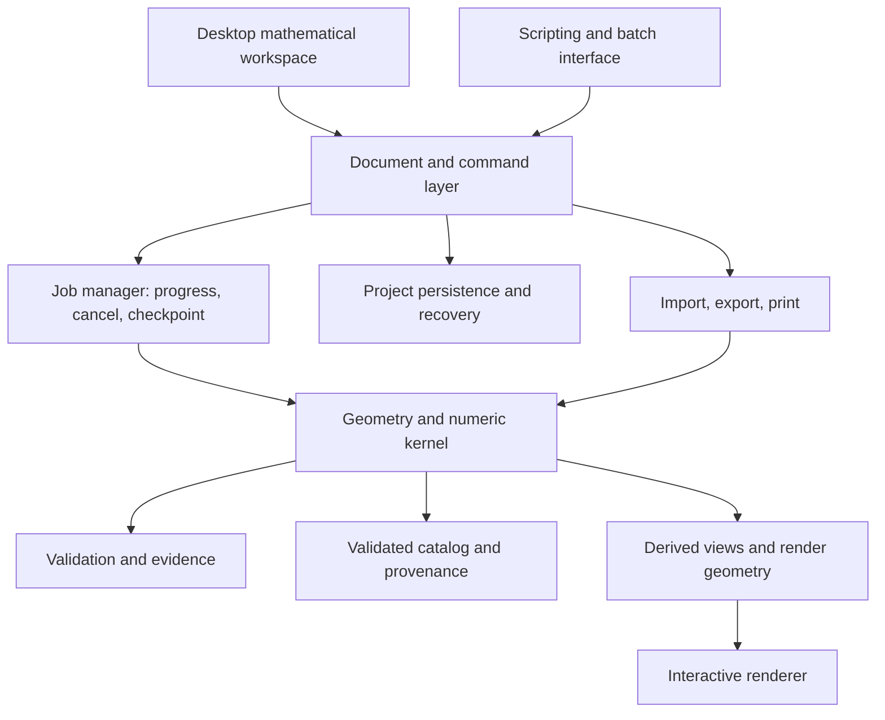

# Mathematically Rigorous Polytope Desktop Application

## Build specification for a feature-complete Stella4D rival

**Prepared:** September 30, 2026  
**Benchmark:** Stella4D / Stella4D Pro 6.0  
**Document status:** Research-backed product and engineering specification; implementation has not started.  
**Existing project inspected read-only:** `C:\Users\Randall\Documents\pardesco-sites\polytope-web-app`.

## 1. Objective and product boundaries

Build a standalone desktop application for constructing, classifying, examining, and validating three- and four-dimensional polyhedral objects. The application should rival the complete Stella4D product and exceed it in mathematical rigor, inspectability, and reproducibility.

Randall's existing **4D Polytope Engine Blender addon** serves the creative modeling and rendering workflow. This desktop application's primary purpose is mathematical work. The addon was not independently audited for this document; its role follows Randall's stated product intent.

The three products have complementary responsibilities:

| Product | Primary responsibility |
| --- | --- |
| Existing web app | Accessible interactive visualization and discovery |
| Existing Blender addon | Creative production, artistic modeling, and rendering |
| Proposed desktop application | Mathematical construction, analysis, classification, validation, and reproducible research |

The desktop application may exchange geometry with the addon, but artistic animation features do not substitute for mathematical capabilities. Desktop rendering exists to support inspection and communication of results.

**Full parity includes Stella4D's substantial 3D functionality.** A product that handles regular 4D polytopes but lacks 3D stellation, faceting, specialized generators, and printable nets is an early research tool, not a feature-complete Stella4D rival.

## 2. Evidence, baseline, and confidence

### 2.1 Competitor baseline

The official release history dates Stella 6.0 to August 11, 2026. Its update adds modern platform/UI support, extends the uniform-polychoron library to 2,191 known forms, improves materials and export, and introduces additional construction tools. Freeze version 6.0 as the initial parity target; subsequent competitor releases require explicit scope review. [Official version history](https://www.software3d.com/History.php)

Use the [official product comparison](https://www.software3d.com/Compare.php), [version 6 manual](https://www.software3d.com/Manual/), and actual installed application to establish the detailed baseline. The current document is a comprehensive work breakdown from documentation, not a completed hands-on conformance audit. Some option behavior and edge cases remain to be confirmed in the installed competitor.

### 2.2 Evidence categories

| Label | Meaning |
| --- | --- |
| Documented baseline | Capability described by Stella's official documentation |
| Observed existing foundation | Capability or limitation found in the inspected web-app source/data |
| Proposed requirement | Behavior recommended for this application |
| Research item | Feasibility or mathematical scope has not been established |
| Planning estimate | Preliminary engineering judgment, not a delivery commitment |

Requirements and estimates below are proposals unless explicitly described as existing or documented. This distinction is particularly important for exact arithmetic, complete enumeration, and nonconvex operations.

### 2.3 Inspection limits

The investigation inspected source, catalog metadata, geometry samples, Git state, and official competitor documentation. It did not benchmark a desktop build, validate every supplied geometry, audit the Blender addon, or run a hands-on comparison against an installed Stella4D 6.0 license.

## 3. Definition of feature-complete

Feature-complete means all baseline user workflows are implemented, validated, documented, and supported for the release's declared operating systems and mathematical domains. Equivalent workflows are sufficient; duplicating Stella's layout or shortcut scheme is unnecessary.

The completion standard is:

1. Every baseline feature and material option has a requirement ID and a conformance scenario.
2. Each requirement specifies dimensions, object classes, numeric guarantees, and supported parameter ranges.
3. Every required scenario passes through the shipped desktop interface and the underlying engine.
4. All required catalog families have reconciled manifests and validation records.
5. Geometry changes survive save/load, undo/redo, and reproducible replay.
6. Import/export, printing, packaging, documentation, and failure handling are complete.
7. No required capability is represented only by a placeholder, screenshot, partial prototype, or unsupported command.

An operation must cover at least the competitor's verified supported domain. A smaller supported domain cannot be hidden behind an error message and still count as full parity.

Create a detailed `parity-ledger` during baseline validation with these fields:

```text
requirement_id, competitor_version, manual_source, competitor_workflow,
dimensions, object_classes, parameter_domain, expected_result,
numeric_contract, implementation_owner, implementation_status,
test_fixture_ids, validation_evidence, known_limits, release_blocker
```

Suggested implementation states: `unstarted`, `research`, `prototype`, `implemented`, `validated`, and `released`. Existing web code is reusable evidence, not proof that a desktop requirement is complete.

### 3.1 Current feature-completeness status

| Area | Current evidence | Desktop release status |
| --- | --- | --- |
| Visualization | Existing web rotation, projection, GPU lines, and export utilities | Reusable foundation; desktop integration unstarted |
| Full topology | Source OFF face/cell data and unpublished parser/surface work | Partial foundation; rigorous representation unstarted |
| Catalog | Existing files and skeleton-grouped browser catalog | Coverage and provenance reconciliation required |
| Construction/analysis kernel | No complete kernel established by the inspection | Unstarted |
| Exact/certified arithmetic and symmetry | No such complete subsystem established by the inspection | Research and implementation required |
| Stellation, faceting, sections, and nets | No feature-complete desktop workflows established | Unstarted |
| Documents, scientific workspace, and packaging | Specification only | Unstarted |
| Full Stella4D parity | Requirements identified; hands-on conformance audit pending | Not achieved; all release gates remain open |

Do not assign a completion percentage by counting reusable files or visible controls. Progress should be measured against validated ledger scenarios, with critical mathematical work weighted explicitly.

## 4. Existing assets and required changes

### 4.1 Reusable foundation

The web app contains six-plane rotation, stereographic/perspective projection, a batched GPU wireframe path, tube rendering, screenshots, share-state handling, video recording, OBJ exports, animation JSON, and a Blender/Alembic conversion script. Its math modules offer a starting point for adapters and regression fixtures.

The local working tree also has an unpublished surface layer retaining source face and cell references. It is useful exploratory rendering code; it is not a rigorous cell-analysis engine.

| Existing component | Reuse strategy | Necessary work |
| --- | --- | --- |
| Rotation/projection mathematics | Preserve as a comparison implementation | Standardize conventions; validate transformations; separate display from measurement |
| GPU wireframe renderer | Reuse for interactive inspection | Picking, stable entity IDs, clipping, linked views, dense-model behavior |
| OFF geometry files | Import into a validated catalog | Provenance, identity, classification, topology, numeric quality, aliases |
| OFF parser | Retain fixtures and format knowledge | Strict 3D/4D import, diagnostics, bounds checks, numeric policy, malformed-input handling |
| Local cell surfaces | Reuse selected rendering techniques | Nonconvex fill semantics, per-cell control, robust triangulation, selectable elements |
| Export utilities | Reuse practical format experience | Engine-owned geometry export, precision and units, topology preservation |
| Viewer interface | Reuse visual components selectively | Mathematical workspaces, inspectors, document model, command history |
| Browser license code | Treat as a separate adapter | Define desktop licensing/offline policy without coupling it to the kernel |

`src/js/polytope/viewer.js` combines roughly 3,000 lines of rendering, state, animation, export, and feature gating. Split those responsibilities before expanding the application.

### 4.2 Catalog identity is a release-critical issue

The inspected data directory contains **2,774 OFF files, approximately 1.57 GB uncompressed**. The active catalog contains **418 representatives**, occupying approximately 122 MB.

The current grouping compares rounded vertex coordinates and edge connectivity. It does not compare complete face/cell incidence. It groups mathematically different objects with the same wireframe skeleton.

Verified examples from the inspection:

| Representative and grouped variant | Shared vertices/edges | Distinguishing topology |
| --- | --- | --- |
| `3-hex` / `17-tho` | 8 vertices, 24 edges | 16 cells / 12 cells |
| `39-rap` / `40-firp` | 10 vertices, 30 edges | 30 faces, 10 cells / 35 faces, 15 cells |
| `890-ope` / `897-thahp` | 12 vertices, 30 edges | 28 faces, 10 cells / 26 faces, 9 cells |

For the desktop application, distinguish coordinate equality, shared skeleton, combinatorial isomorphism, geometric congruence, and classification identity. Store topology variants separately. Shared render buffers and skeleton-group navigation may remain useful optimizations.

The supplied file count does not establish parity with the 2,191 uniform forms. The corpus includes other categories and must be reconciled individually.

### 4.3 Existing limitations

- Tube mesh mode disables 4D rotation above 1,200 edges. Catalog metadata includes objects with up to 57,600 edges.
- The local surface renderer omits self-intersecting star faces and deduplicates shared faces for display.
- Mesh exports primarily represent edge tubes, rather than complete mathematical boundaries or guaranteed printable solids.
- Matrix-5 embeds 4D geometry into a fifth coordinate; it is not a general 5D topology/construction kernel.
- Stereographic edge rendering normalizes sampled points onto the sphere. Mathematical lengths, intersections, and sections must use source geometry rather than those display samples.
- Existing metadata and README statements are inconsistent in places; the new specification must derive counts and properties from validated objects.

### 4.4 Protect the existing products

The live site, Git HEAD, and local working tree differ. The session handoff records restored production and unpublished revisions. Treat those records as historical deployment evidence, not a fresh deployment API check.

Build in a separate repository. Record which snapshot is copied, preserve attribution, and review local revisions individually. Do not reset, build into, commit, deploy, or otherwise modify the read-only web-app project as part of this work.

## 5. Full parity requirements

The tables below are the initial requirements inventory. All rows are required for baseline parity unless explicitly placed in Section 12 as an extension. Detailed installed-app verification must expand each row into option-level cases.

### 5.1 Libraries and classification

Stella's documented catalog includes broad 3D families, all 16 regular polychora, the 2,191 known uniform polychora, and parameterized infinite families. These are distinct coverage obligations. [Catalog comparison](https://www.software3d.com/Compare.php)

| ID | Required coverage | Acceptance condition |
| --- | --- | --- |
| LIB-01 | Platonic, Archimedean, Kepler-Poinsot, remaining uniform polyhedra, and duals | Named manifest; counts and incidence checked; alias and symbol search |
| LIB-02 | Johnson solids and documented near misses | Exact/approximate status distinguished; deviation metrics for near misses |
| LIB-03 | Stewart toroids, noble polyhedra, compounds, and specialized catalog families | Reconcile current competitor families; preserve genus, component, and chirality data |
| LIB-04 | All 16 regular 4-polytopes | Six convex and ten nonconvex forms independently represented and validated |
| LIB-05 | All 2,191 baseline known uniform polychora | Entry-level crosswalk; no skeleton-based loss of distinct topology |
| LIB-06 | Uniform fissaries, scaliforms, coincidic/regiment relationships, and 4D compounds | Match the benchmark's verified collection; explicitly record classification/source |
| LIB-07 | Infinite prism, antiprism, duoprism, and antiduoprism families | Generators with validated rational polygon parameters and documented resource limits |
| LIB-08 | Naming and navigation | Search by names, aliases, indices, symbols, family, counts, and geometry properties |

Do not imply that matching the published uniform catalog proves a complete classification of all possible 4-polytopes. Preserve the baseline's definition of “known” and date each classification source.

### 5.2 Mathematical views, selection, and information

| ID | Required workflow | Acceptance condition |
| --- | --- | --- |
| VIEW-01 | Linked base, dual, compound, section, face/cell, vertex-figure, net, and diagram views | Selection and model changes propagate consistently without altering the source object |
| VIEW-02 | Orthogonal and perspective 4D projections, plus 3D camera controls | CPU reference and GPU output agree within declared display tolerance |
| VIEW-03 | Entity-aligned 4D views | Vertex/edge/face/cell first and last orientations; selected-item orientation preserved |
| VIEW-04 | Front/back cell visibility, per-element hide/show, and isolation | Visibility changes do not delete topology or change computed invariants |
| VIEW-05 | Selection and identification | Reliable picking through dense projections; index selection; cycle ambiguous hits |
| VIEW-06 | Rotation, reflection, and subgroup display | Clearly identify dimension and the meaning of the displayed transformation |
| VIEW-07 | Stereoscopic, fullscreen, and multiple-view display | Benchmark-supported stereo modes and layouts operate on shipped hardware configurations |
| INFO-01 | Names, indices, symbols, element counts/types, and component information | Report calculated values with provenance and any unavailable properties |
| INFO-02 | Radius, area, volume, density/genus where meaningful, and dihedral data | Explicit definitions and dimension; no undefined value presented as a valid scalar |
| INFO-03 | Model comments, references, and editable metadata | Save/load and export preserve user metadata and source references |

The official information panel links element types to selected geometry and exposes model and compound information. The proposed inspector should preserve that workflow while adding numeric status and validation evidence. [Information panel](https://www.software3d.com/Manual/Info.php)

Projection orientation and cell visibility are distinct from intrinsic geometry. Their baseline behavior is described in the [4D menu](https://www.software3d.com/Manual/Menu4D.php).

### 5.3 Measurements, units, and expressions

| ID | Required workflow | Acceptance condition |
| --- | --- | --- |
| MEAS-01 | Distances involving vertices, lines, planes, and supported 4D entities | Intrinsic-coordinate results; analytic fixtures; degenerate input diagnostics |
| MEAS-02 | Angles, radii, area, volume, and applicable 4D measures | Definitions specify signed/unsigned and intrinsic/projected interpretation |
| MEAS-03 | Physical scaling and units | Model scale, viewport zoom, print scale, and export units remain independent |
| MEAS-04 | Expression entry | Safe expression parser, constants, arithmetic, roots, trig, and polygon helper functions |

Stella supports numeric expressions in fields, including polygon-specific helpers; equivalent scientific input belongs in parity. Define parser semantics explicitly so rational polygon notation cannot be mistaken for division. [Expression entry](https://www.software3d.com/Manual/Equations.php), [scale behavior](https://www.software3d.com/Manual/Scale.php)

### 5.4 Construction and modification

| ID | Required construction | Acceptance condition |
| --- | --- | --- |
| CON-01 | Blocks, triangular grids, pyramids, irregular tetrahedra/triangular prisms, prisms, and antiprisms | Parameter validation; impossible dimensions explained; exactness recorded |
| CON-02 | Podia, antipodia, stephanoids, torus constructions, and Waterman objects | Match verified generator options and sequences; independent topology fixtures |
| CON-03 | 3D/4D convex hulls and convex cores | Degeneracy-aware output; operation definition preserved; certified or bounded numeric decisions |
| CON-04 | Duals and reciprocation centers | User-selected center/radius; well-defined failure or unbounded result handling |
| CON-05 | Truncation, rectification, and expansion/runcination in supported 3D/4D domains | Correct incidence at ordinary and transition parameters; parameterized history |
| CON-06 | Mirroring, pseudo-uniform transformations, adding/blending duals, and compound part operations | Chirality, component identities, and topology are preserved or explicitly changed |
| CON-07 | 3D augmentation, excavation, drilling, and placing models on faces/vertices | Face matching, orientation, coincidence handling, and preview/commit agree |
| CON-08 | Zonohedrification, face/edge subdivision, geodesic construction, and sphere projection | Match verified option domains and data inheritance; prevent false regularity claims |
| CON-09 | Regular-face, equal-edge, and equal-area fitting | Solver residuals, convergence status, tolerances, and non-solution cases exposed |
| CON-10 | Coplanar-face blending and relevant coincidence operations | Preserve boundary cycles and semantic identities; changes recorded in history |
| CON-11 | 4D prisms on 3D bases, duoprisms, antiduoprisms, and step prisms/gyrochora | Product and parameter definitions documented; rational star polygons retained |
| CON-12 | Segmentotopes, including benchmark crossed variants | Convex and nonconvex definitions distinguished; orientation and parameter domains verified |
| CON-13 | Uniform/scaliform construction from eligible 3D vertex figures | Validate admissibility and ambiguous choices; never infer universal success from a few examples |
| CON-14 | 3D spring-network relaxation and supported near-miss constraints | Match verified initialization/constraint controls; expose convergence, residuals, and invalid realizations |

Specialized generator scope comes from the manual's [construction chapters](https://www.software3d.com/Manual/) and [Waterman generator](https://www.software3d.com/Manual/Waterman.php). The vertex-figure and 4D product workflows are described in the [4D menu](https://www.software3d.com/Manual/Menu4D.php).

Reciprocation requires a chosen center, which can affect nonsymmetric input. [Reciprocation centers](https://www.software3d.com/Manual/Modify.php)

Augmentation parity includes attaching and removing models at matching faces, rather than an unspecified general solid Boolean operation. General Booleans would require a separate contract. [Augmentation](https://www.software3d.com/Manual/Augmentation.php?prod=Stella4DPro)

Fitting is an approximate optimization workflow. Matching a requested condition is not guaranteed simply because an optimization command terminates. [Condition fitting](https://software3d.com/Manual/TryTo.php)

Spring relaxation is a separate baseline workflow requiring installed-version verification. Its output is a numerical realization candidate and must undergo the same geometric checks as other fitted objects. [Author's description of spring relaxation](https://software3d.com/PolyNav/PolyNavigator.php)

### 5.5 Sections and vertex figures

| ID | Required workflow | Acceptance condition |
| --- | --- | --- |
| SEC-01 | 2D sections of 3D objects and 3D sections of 4D objects | Complete reconstructed boundaries, not just isolated edge-intersection points |
| SEC-02 | Arbitrary orientation, depth, selected-entity alignment, and vertex-event stepping | Stable behavior through tangencies, coplanarity, disconnected sections, and topology changes |
| SEC-03 | Interactive and animated sections | Deterministic parameter evaluation; source-element provenance retained |
| SEC-04 | Convert derived section or vertex figure into a new base model | Independent editable object with construction record and numeric status |
| SEC-05 | Nonconvex and star-object sections in benchmark-supported domains | Explicit intersection/fill semantics; do not replace them with their convex hull |
| VF-01 | 3D polyhedron and 4D polytope vertex figures | Local incidence validated; slicing-based and combinatorial interpretations distinguished |

Stella's section workflow reduces entity dimension and can produce multiple components for nonconvex inputs. That is a topology problem, not merely a clipping shader. [Cross-sections](https://www.software3d.com/Manual/Slice.php)

### 5.6 3D stellation and faceting

| ID | Required workflow | Acceptance condition |
| --- | --- | --- |
| STEL-01 | Stellation from seed facial planes or a supported arbitrary plane set | Robust arrangement construction, bounded/unbounded region identification |
| STEL-02 | Manual region/cell inclusion, stellation diagrams, attached diagrams, and cell-dependency diagrams | Diagram selection maps to the correct geometric regions and symmetry orbits |
| STEL-03 | Enumeration and stepping under benchmark criteria | Criterion semantics explicit; finite bounded fixtures have independently checked counts |
| STEL-04 | Symmetry/subsymmetry and reflexibility controls | Selected group actually constrains result generation |
| STEL-05 | Inaccessible-cell handling and derived-model promotion | Match verified baseline semantics; no silent interior topology deletion |
| FAC-01 | Manual coplanar facet construction from existing vertices | Planarity check, ordered cycle editing, star/repeated-vertex semantics where supported |
| FAC-02 | Automatic facet candidates and valid faceting enumeration | Correct incidence filters; duplicate results identified using defined equivalence |
| FAC-03 | Criteria, partial facetings, type limits, per-plane limits, and spiky filters | Filtered searches report limits and whether enumeration completed |
| FAC-04 | Faceting diagrams, symmetry replication, and conversion to base model | Preview, final topology, and saved construction agree |

The baseline includes criteria-driven stellation and manual cell selection. [Stellation](https://www.software3d.com/Manual/Stellation.php)

Faceting changes faces while retaining a vertex set. Baseline enumeration includes several validity criteria and limiting options. The implementation must distinguish an exhausted search from an interrupted or restricted one. [Faceting](https://mail.software3d.com/Manual/Faceting.php), [automatic faceting](https://www.software3d.com/Manual/AutoFacet.php?prod=Stella4DPro), [faceting diagrams](https://software3d.com/Manual/FacetDiag.php)

These are major baseline workstreams. They cannot be postponed beyond the feature-complete release.

### 5.7 Nets, folding, and physical construction

| ID | Required workflow | Acceptance condition |
| --- | --- | --- |
| NET-01 | Generate and manually rearrange 2D nets for supported 3D polyhedra | Every source face represented; cuts and connections map to source edges |
| NET-02 | Tabs, cut/uncut editing, coincident-edge policies, numbering, and color separation | Printable assemblies have consistent matching IDs and physical dimensions |
| NET-03 | Page packing, preview, scaled printing, images/labels, and multiple nets | Calibrated output; no unreported scale change or clipped net |
| NET-04 | Animated folding of 3D polyhedron nets | Hinge geometry correct; endpoints reconstruct source model within declared tolerance |
| NET-05 | Internal reinforcement parts and measurement export | Match verified construction workflows and units |
| NET-06 | 3D nets of 4D polytopes with manual cell rearrangement | Cell-face adjacency preserved; matching elements highlighted; arrangement persisted |

Paper-model workflows include packing, physical scale, connection labels, and folding. [3D nets and folding](https://www.software3d.com/Manual/Build.php)

Stella's 4D nets are arrangements of whole 3D cells; its documented implementation ignores intersections between cells in those arrangements. Matching that workflow is required. Collision-aware 4D unfolding and partially folded 4D nets are additional research features. [4D nets](https://www.software3d.com/Manual/Net4D.php)

### 5.8 Transformations, animation, and visual communication

| ID | Required workflow | Acceptance condition |
| --- | --- | --- |
| ANIM-01 | 3D/4D rotation, explosion, section-depth animation, and fold animation | Time-based evaluation; reproducible endpoints; cancellable execution |
| ANIM-02 | All verified benchmark dual-morph methods and supported dimensions | Method-specific domain, parameter range, and topology-transition behavior documented |
| ANIM-03 | Transitions and polyhedral tours | Saved ordered sequences; deterministic playback and export |
| VIS-01 | Faces/cells, lines, vertex spheres, edge cylinders, and Geomag-style presentation | Rendering modes preserve source geometry and meaningful scale settings |
| VIS-02 | Per-element/type/subgroup coloring, transparency, selection highlighting, and overlap rules | Display semantics consistent across linked views and saved files |
| VIS-03 | Benchmark 3D materials, themes, images, bump maps, reflection/refraction, and lighting | Match verified options; portable assets and presets; correct dimension restrictions |
| VIS-04 | Formatted text on elements and textures on printable nets | Persist content and formatting; match print/export behavior |

Inventory every dual-morph mode separately during installed-app verification. Its domain and behavior can differ from other modes; several do not generalize to 4D. [Dual morphing](https://www.software3d.com/Manual/Morphing.php?prod=Stella4DPro)

Materials are supporting parity functionality. The documented Stella materials dialog is a 3D workflow. Full 4D material support is an extension, rather than grounds for reducing mathematical scope. [Materials](https://www.software3d.com/Manual/Materials.php)

### 5.9 Documents, interchange, and desktop operation

| ID | Required workflow | Acceptance condition |
| --- | --- | --- |
| DOC-01 | Native projects, multiple documents, undo/redo, and derived-model promotion | Full geometry, metadata, display, and construction state survive round trips |
| DOC-02 | Model memories, retrieve/swap, and add/blend operations | At least equivalent quick-store workflows; scale and component handling correct |
| DOC-03 | Autosave, recovery, migrations, and reproducible construction history | Interrupted writes cannot corrupt the last valid document |
| IO-01 | OFF/4OFF and baseline DXF import | Format validation, dimension detection, attribute preservation, precision diagnostics |
| IO-02 | DXF, POV-Ray, VRML, OBJ, OFF, and STL model export | Baseline-equivalent workflows; selected derived view export; units and precision verified |
| IO-03 | Still images, transparent output, image sequences, and baseline video formats | Anti-aliasing and frame settings; deterministic mathematical state per frame |
| IO-04 | Direct printing and export of net measurements | Printer calibration, preview, page settings, and correct units |
| DESK-01 | Native menus, file dialogs, shortcuts, view layouts, high-DPI scaling, and context help | Complete operations are accessible without developer tools |
| DESK-02 | Installation, upgrades, offline computation, and documented hardware support | Clean-machine install and update tests; no hosted viewer dependency |

OFF and DXF have different baseline import restrictions; record them as testable cases. [Import](https://www.software3d.com/Manual/IO.php?prod=Stella4DPro)

Model export must support geometry from selected derived views, not only the original catalog object. [Model export](https://www.software3d.com/Manual/Export.php)

Video export covers mathematical motion such as section depth, folding, and dual morphing. Verify all offered baseline containers/codecs on the parity platform and document platform availability. [Image/video export](https://www.software3d.com/Manual/ExportImage.php)

Model memories support retrieval, swapping, and adding/blending at controlled relative scales. [Memories](https://www.software3d.com/Manual/Memories.php)

**Native Stella `.stel` import is a separate migration investigation.** Supporting equivalent project persistence in our own format is required; reading an undocumented proprietary format is not assumed feasible. Initially use supported exchange formats, disclose any lost metadata, and investigate direct compatibility only through documented interfaces or a clearly defined authorized interoperability path.

## 6. Mathematical kernel architecture

### 6.1 Represent objects independently of rendering

Use a dimension-aware incidence representation rather than extending an edge-list renderer into the engine. A plain 3D triangle mesh cannot preserve all required 4D topology.

An object record should contain:

```text
ObjectRecord
  stable object ID; intrinsic and embedding dimension
  object interpretation/classification; components and relationships
  coordinate representation and numeric status
  vertices with persistent IDs
  edges with ordered endpoints
  faces with ordered boundary cycles and orientation
  cells with oriented face incidence
  rank-aware incidence/adjacency and optional flag structure
  geometric realization, transforms, and units
  symmetry data and verification status
  construction graph and operation provenance
  attributes, annotations, source references, validation evidence
```

Generalized objects may require repeated incidences, coincident but distinct elements, multiple components, or non-manifold interpretation. Do not force them into a manifold-only schema. Define whether a record is an abstract polytope, geometric complex, compound, or another supported generalized polyhedron/polychoron.

Keep render meshes, tessellation, visibility, and GPU buffers as derived caches. Rebuilding a cache must not change mathematical identity.

### 6.2 Coordinate conventions

The web app has differing coordinate labels in some 4D/5D modules; the 4D pipeline treats component zero as the projection coordinate. Establish one kernel convention, with explicit adapters for legacy files and renderer uniforms.

A proposed convention is `(x, y, z, w)` in the kernel, with separately named projection coordinate and camera transform. Serialize basis order. Tests must detect axis swaps and orientation reversal.

### 6.3 Operation contracts

Every operation exposes its supported dimensions/classes, parameter domain, numeric mode, preconditions, and validation policy. Return:

```text
result object(s)
source-to-result element correspondence
numeric/certification status
operation parameters and implementation version
validation results and diagnostic evidence
termination/completeness status where a search is involved
```

Preview uses the same semantic operation as commit. Approximate preview results may be displayed sooner, but must be labeled and replaced by the authoritative result before committing a certified construction.

### 6.4 Construction history

Use an operation graph with immutable inputs and parameters. Cache evaluated results by input identity, parameters, numeric policy, and algorithm version. Store snapshots where replay alone would be too costly or an older implementation is unavailable.

Undo/redo must restore document state, not merely reverse camera or shader changes. Save geometry alongside history so users can inspect a document even when a plugin or algorithm version is missing.

## 7. Numeric rigor and correctness policy

### 7.1 Numeric modes

| Mode | Intended use | Permitted claim |
| --- | --- | --- |
| Rational exact | Rational constructions and predicates | Exact relative to recorded rational input |
| Algebraic exact | Supported algebraic coordinates/constructions | Exact relative to represented algebraic values and validated algorithms |
| Interval-certified | Bounded uncertain input or numerically evaluated predicates | Certified statement within recorded bounds |
| High-precision approximate | Difficult numerical construction and fitting | Approximation with precision, residuals, and convergence status |
| Display float | GPU visualization | Display approximation only |

A decimal OFF import can be interpreted exactly as the supplied decimal value, but that does not prove it equals the original author's intended algebraic coordinate. Automatic radical recognition must produce a candidate awaiting verification, not silently change source data.

Not every scientific expression has an algebraic exact result. Arbitrary trigonometric arguments and other transcendental expressions require a declared numerical or certified evaluation path.

### 7.2 Exact predicates versus exact constructions

Correct orientation tests do not alone guarantee exactly constructed intersections. Document both guarantees. Use filtered computations where appropriate: fast approximate evaluation followed by stronger arithmetic when the sign or equality is unresolved.

Real algebraic number representations and isolating intervals are existing building blocks, but integrating them into a practical polytope engine remains substantial work. [CGAL algebraic-kernel documentation](https://doc.cgal.org/latest/Algebraic_kernel_d/index.html)

### 7.3 Equality and tolerances

Separate exact identity, coordinate coincidence under tolerance, combinatorial isomorphism, congruence, and catalog classification. Record tolerance with units and model scale. A tolerance-based merge is an explicit geometric edit, with an audit record and undo support.

### 7.4 Property semantics

Define volume, density, winding/fill rules, self-intersection, and connectedness for each supported object class. Report undefined or unsupported properties explicitly. A signed integral, union volume, and sum of component volumes are different measurements.

For nonconvex objects, specify what constitutes the interior and how overlaps contribute. Fill rules used by the renderer must not silently become the mathematical definition of the object.

## 8. Symmetry and analysis

Baseline 3D symmetry/subgroup workflows influence coloring, stellation, faceting, and augmentation. [Symmetry controls](https://www.software3d.com/Manual/Symmetries.php)

The proposed rigor extension must distinguish:

- **Combinatorial automorphisms:** permutations preserving the incidence structure.
- **Geometric symmetries:** transformations preserving the actual realization.
- **Rotational subgroup:** orientation-preserving geometric transformations.
- **Approximate symmetries:** transformations accepted only within declared bounds/tolerances.

Do not infer geometric symmetry from a vertex/edge graph alone. Face/cell incidences and the realization matter. Combinatorial and geometric symmetry need not coincide. [Research discussion of these distinctions](https://polymake.org/polytopes/paffenholz/data/preprints/polytopes_from_products.pdf)

Provide generators, group order, element orbits, stabilizers, subgroup restrictions, and transformation/permutation correspondences for supported cases. A verified subgroup is not automatically the complete symmetry group. Distinguish a complete group computation from partial generators or search exhaustion under a bound.

Suggested initial analytic fixtures include regular 4-polytopes with expected full geometric group orders: 5-cell 120, tesseract/16-cell 384, 24-cell 1,152, and 120-cell/600-cell 14,400. These are proposed regression targets to verify from independent mathematical references before implementation acceptance; do not treat this document itself as their authority.

Additional analysis should expose incidence matrices, face/cell adjacency, local links/vertex figures, orbit partitions, and rank-based counts. Topological summaries must be calculated under the correct object interpretation.

## 9. Construction and search algorithms

### 9.1 Convex geometry

Develop hull, halfspace, intersection, section, and polar-duality workflows first. Preserve coplanar non-simplicial facets after any internal triangulation. A triangulated tesseract boundary must not be presented as a tesseract with different mathematical cell structure.

Qhull supports higher-dimensional convex computations, including 4D, but explicitly does not provide nonconvex mesh generation or nonconvex surface triangulation. It is a candidate component or comparison tool, not the complete kernel. [Qhull capabilities](https://www.qhull.org/)

### 9.2 Group-based generators

Implement validated reflection/group-orbit constructions for supported families. Separate group generation, seed parameter selection, orbit generation, and recovery of complete incidence. Handle chirality and snub/non-Wythoffian cases explicitly.

A reflection generator alone does not establish coverage of all 2,191 known uniform polychora. Some families require other constructions or independently sourced validated incidence data.

Antiprism's documented Wythoff-style and uniform-polyhedron generators are useful 3D reference candidates. They do not constitute a ready-made general 4D kernel. [Wythoff-style tool](https://www.antiprism.com/programs/wythoff.html), [uniform-polyhedron tool](https://www.antiprism.com/programs/kaleido.html)

### 9.3 Nonconvex geometry

Implement ordered star boundaries, intersections, coincident elements, repeated incidences, compounds, and admissible generalized cells as explicit object classes. Test disconnected sections and geometry crossing slice hyperplanes repeatedly.

Avoid reconstructing face/cell structure from nearest-neighbor edges or convex hulls when original incidence is available. Those substitutions can destroy the object being studied.

### 9.4 Enumeration

Stellation and faceting searches require candidate generation, constraint checks, symmetry reduction, isomorphism/congruence policy, persistent search state, and resource accounting.

Return one of: `complete`, `user-cancelled`, `resource-limited`, or `failed`. Record the search domain and criteria. A count from a bounded or interrupted search is a lower bound or partial result, not an exhaustive enumeration.

Support checkpoint/resume and streaming results. Avoid retaining every candidate in memory.

## 10. Desktop architecture and technology decisions

### 10.1 Proposed layers



All mathematical results must be computable without the graphical interface. The renderer must not be the only implementation of an operation.

### 10.2 Desktop shell

Evaluate Electron and Tauri using the same fixtures. Electron embeds Chromium/Node and closely fits the existing JavaScript renderer. Tauri uses system webviews and a Rust backend, with a different packaging and integration profile. Shell choice does not decide the mathematical kernel language. [Electron](https://www.electronjs.org/docs/latest/), [Tauri architecture](https://v2.tauri.app/concept/architecture/)

Preliminary preference: Electron for the first reuse prototype, conditional on benchmarks and packaging requirements. Keep the renderer and IPC adapters replaceable. Do not invest in a complete native interface rewrite without evidence that web-based rendering prevents the required workflows.

### 10.3 Kernel language

Prototype the numeric/geometry dependencies before selecting Rust or C++ as the principal kernel language. Selection criteria: required arithmetic types, robust 4D algorithms, nonconvex representation, dependency rights, maintainability, bindings, deterministic serialization, and performance.

C++ may reduce integration effort with some established geometry/arithmetic libraries. Rust may offer a strong application/runtime foundation. Neither choice eliminates algorithm research. A narrow process or C ABI can permit mixed-language components without exposing library internals to the UI.

### 10.4 IPC and storage

Use structured commands and results. Transfer large geometry buffers efficiently; do not repeatedly serialize full models as JSON per frame. Reference immutable objects by ID and version.

Suggested project format: a versioned container containing a manifest, geometry/incidence tables, numeric encodings, construction graph, attributes, source records, and optional derived caches. Store external material assets portably. Write atomically and retain recoverable prior versions.

Use a searchable local catalog database or indexed manifests. The published database can be rebuilt from authoritative catalog records; it must not be the only copy of source evidence.

### 10.5 Scripting and headless operation

Expose the same operation contracts through a headless API and command-line interface. A Python binding is a proposed research-workflow addition; do not require embedded Python merely to perform core calculations. Scripts record dependencies, seed values, and numeric policy where relevant.

The application computes locally after installation. Optional catalog updates and license validation must be separate from ordinary geometry computation.

## 11. Desktop interaction and rendering

The interface should center on model identity, construction parameters, linked geometric views, selection, and mathematical evidence. Provide:

- A catalog browser with classification and source status.
- A document workspace with linked projections, sections, cells, figures, and diagrams.
- An inspector showing geometry, incidence, measures, symmetry, and numeric status.
- Construction history with editable parameters and derived-object promotion.
- Search/enumeration controls with scope, progress, completeness, and checkpoint state.
- Error messages identifying the failing precondition and affected element IDs.

Rendering requirements include stable picking, dynamic clipping, sensible singularity handling, and independent visibility for coincident elements. Preserve separate selectable IDs even if geometry shares a GPU buffer.

Retain stereographic projection as an additional view. Clearly identify it as a visualization transformation; measurements remain intrinsic. Handle poles and discarded/clipped geometry visibly rather than presenting an apparently complete object after hidden omissions.

Use transparency and clear highlighting to aid inspection. Full 4D physically based materials are optional beyond parity; they do not determine mathematical completeness.

## 12. Features that would exceed Stella4D

The official manual states that 4D symmetry grouping is heuristic and that several 3D operations, including stellation, faceting, and partially folded nets, are not extended to 4D. These are documented openings, not proof that general extensions are straightforward. [4D supported features and limits](https://www.software3d.com/Manual/Features4D.php)

| Extension | Proposed scope | Release relationship |
| --- | --- | --- |
| Exact/certified numeric workflow | Supported constructions retain declared arithmetic guarantees and evidence | Core rigor differentiation for the complete release |
| Verified 4D symmetry | Complete groups for validated families; explicit partial/approximate status elsewhere | Core rigor differentiation for the complete release |
| Reproducible construction records | Parameters, versions, inputs, results, and validation preserved | Core rigor differentiation for the complete release |
| Inspectable classification/corpus | Distinct topology, sources, aliases, and reconciliation manifest | Core rigor differentiation for the complete release |
| Scripted/batch analysis | Repeatable experiments and machine-readable reports | Core rigor differentiation; can arrive before broad parity |
| 4D partially folded nets | Valid hinge motion in 4D, shown through projections; collision semantics defined | Separate research milestone |
| 4D stellation/faceting | Formal object/domain definition and workable algorithms | Separate research milestone; not part of baseline parity |
| Richer 4D materials | Better display of selected cells and sections | Optional display extension |
| Higher-dimensional generalization | Dimension-generic incidence where feasible | Architectural allowance, not a 5D feature promise |

The full rival milestone requires baseline parity plus the first five rigor improvements. The unproven research extensions must not become prerequisites that indefinitely prevent shipping the complete baseline product.

## 13. Validation and independent evidence

### 13.1 Reference corpus

Create a small trusted corpus first, then grow it to the full catalog. Include convex regulars, nonconvex regulars, uniform/nonuniform cases, chiral objects, toroids, compounds, coincidic variants, repeated incidences, near misses, and malformed imports.

Use independent definitions and calculations for expected values. Stella outputs are useful differential evidence but not the sole correctness oracle. When tools disagree, investigate definitions and numeric assumptions before choosing a result.

The current web-app inspection checked the six regular convex polytopes for index validity, face incidence, and `V - E + F - C = 0`. Those tests passed. They do not prove the whole library, geometric validity, or general manifold behavior.

### 13.2 Structural checks

Verify valid IDs, boundary cycles, incidence consistency, component structure, local links, and orientation where meaningful. Use boundary-of-boundary checks for an applicable oriented cellular representation. Apply Euler/genus formulas only to object classes meeting their hypotheses.

Do not require every generalized object to satisfy the topology of a convex-polytope boundary. Conversely, do not label a malformed ordinary manifold object “generalized” merely to bypass validation.

### 13.3 Geometric checks

Test planarity, affine dimension, edge/face regularity, embedding consistency, supporting hyperplanes where applicable, and self-intersection classification. Check exact computations independently on representative fixtures.

Measure deviations for approximate models. Cross-check at increasing precision; unresolved numerical classification remains unresolved in the UI and report.

### 13.4 Operation tests

Required categories:

1. Analytic fixtures for hulls, sections, duals, and generated families.
2. Transformation invariance and scale/unit covariance.
3. Dual-of-dual behavior under stated center/polar conventions.
4. Sections through vertices, edges, faces, tangent positions, and empty intersections.
5. Nonconvex disconnected sections and star-fill cases.
6. Symmetry actions preserving geometry and full incidence; verified group completeness on trusted families.
7. Exhaustive small enumeration cases and bounded-search completeness reporting.
8. Net reconstruction, cut/connection identities, folding endpoints, and calibrated print dimensions.
9. Save/load, history replay, migrations, cancellation, and crash recovery.
10. Independent-format round trips that expose rather than conceal lossy interchange.

### 13.5 Numerical/property certificates

Validation reports must state input interpretation, arithmetic type, precision/tolerance, algorithm/version, assumptions, assertions checked, and unresolved conditions. A “validated” badge means the named checks passed, not a formal proof of every possible property.

### 13.6 Human mathematical review

Require review by a computational-geometry/polytope specialist for the schema, exactness contracts, nonconvex semantics, symmetry-completeness claims, and enumeration criteria. AI-generated code still needs independently established expected results.

## 14. Performance and resource requirements

These are proposed acceptance targets, to be calibrated in the feasibility phase:

| Workload | Initial target |
| --- | --- |
| Normal desktop input and selection | Responsive UI; computational jobs never block the interface thread |
| Regular-polytope inspection | Approximately 60 FPS at 1080p on named supported hardware |
| Dense corpus objects | Adaptive display detail, measured memory use, visible progress; retain complete mathematical data |
| Hulls, exact sections, and enumeration | Background jobs with cancellation, progress, resource policy, and checkpoints where applicable |
| Catalog launch | Search usable without parsing the entire geometry library |
| Export | Streaming or chunked operation; deterministic states; bounded working memory |
| Long sessions | Repeated document switching does not leak geometry buffers, processes, or caches |

Benchmark integrated and discrete GPUs and representative exact/approximate jobs. Record raw sizes, peak RAM, GPU memory where measurable, cold/warm timings, numeric mode, object complexity, and view type.

A desktop wrapper does not remove the current tube-rendering bottleneck. Optimize or replace the expensive path, but never reduce mathematical topology to meet an FPS target. View simplification must be visible and reversible.

For exact computation, prefer an honest progress estimate or resource limit over a guarantee of interactive speed on arbitrarily large input.

## 15. Catalog provenance and dependency evaluation

Every shipped geometry requires source attribution, classification date, redistribution basis, numeric quality, and transformation history. Existing OFF files are a valuable starting corpus, but their redistribution provenance was not established by this investigation.

Review candidate dependencies against actual required operations. Distinguish production components, test/reference tools, and offline generation tools. Review relevant package/component terms before committing to a distribution model; the project can continue with unaffected components while questions are resolved.

Dependency evaluation must answer:

- Does it support intrinsic 4D computations or only 3D mesh processing?
- What exact arithmetic and degeneracies does it handle?
- Does it preserve non-simplicial and nonconvex incidence?
- Are APIs/serialization stable enough for reproducible projects?
- Can its use and generated assets be distributed under the chosen product terms?
- Can it be independently checked and replaced behind a narrow interface?

Do not presume that bundling a convex hull library or a uniform-polyhedron generator supplies a complete mathematical engine.

## 16. Release platforms and operational completeness

Proposed first conformance platform: **Windows x64**. Evaluate Windows ARM separately and schedule native macOS/Linux builds after the kernel and application contracts stabilize. An initial Windows parity release can be complete for its declared platform; cross-platform completeness is a separate milestone with its own tests.

For every advertised platform provide installer/uninstaller, appropriate signing, compatible updates, native dialogs/printing, clean-machine tests, hardware/OS support tables, offline operation, and recovery tests. Verify each export format and printer workflow on each platform. Do not advertise uniform platform capability while quietly removing required workflows.

A licensing design decision is required before release: paid/perpetual/subscription or open distribution; offline activation/grace behavior; commercial rights; institutional deployment; update entitlement. Mathematical computations should remain usable under the documented license policy without an always-on remote calculation service.

Provide a complete manual, glossary, operation-domain tables, scientific examples, numeric-guarantee explanations, and searchable context help. Tutorials should explain constructions and results, not substitute for API or algorithm documentation.

## 17. Implementation phases and exit gates

These phases sequence the complete scope. Early exits are useful internal milestones, not permission to drop later required parity features.

| Phase | Indicative elapsed schedule | Deliverable and exit gate |
| --- | --- | --- |
| A: Baseline and architecture feasibility | Months 0-2 | Installed-app parity ledger; schema; numeric dependency experiments; shell benchmark; source/provenance inventory |
| B: Kernel and documents | Months 2-6 | Exact rational/algebraic subset, full incidence, strict import, persistent projects/history, six regular convex fixtures |
| C: Convex construction and analysis | Months 4-10 | Sections, duals, hulls, product generators, linked views, measurements, initial verified symmetry |
| D: Nonconvex corpus and broad generators | Months 7-16 | Nonconvex regulars, catalog reconciliation, remaining generator families, consistent generalized-object semantics |
| E: Stellation, faceting, and construction completion | Months 10-24 | Baseline criteria, diagrams, searches, augmentation/modification scope, validated operation domains |
| F: Nets and supporting parity | Months 10-24 | 3D/4D nets, physical outputs, folding, materials, morph methods, memories/tours, interchange |
| G: Conformance and product hardening | Months 20-30+ | All required scenarios validated, mathematical review, complete docs, Windows release qualification |
| H: Platform expansion and research extensions | After prerequisites stabilize | Independently qualified platforms and separately scoped advanced 4D research features |

**Planning envelope: approximately 24-36 months for a feature-complete, mathematically reviewed rival with a suitably staffed team.** Some overlap is possible; uncertainty is high until Phase A. This replaces any earlier artist-tool beta estimate. Specialized algorithm research or corpus/provenance problems can extend the schedule.

The feasibility phase itself must deliver:

- A signed-off interpretation of every benchmark family and workflow.
- Correct independent representations of selected same-skeleton/different-topology objects.
- A typed numeric prototype with exact and approximate examples and clear guarantees.
- A degenerate 4D section example producing validated 3D topology.
- A verified symmetry computation for a trusted case, with combinatorial/geometric distinction.
- A preliminary stellation/faceting implementation plan and dependency assessment.
- Reproducible measured performance and a revised effort estimate.

## 18. Team and effort model

This is a proposed staffing model, not an assertion that the existing team has these roles available:

| Role | Responsibility |
| --- | --- |
| Mathematical/geometry lead | Object semantics, algorithms, correctness contracts, expert review |
| One or two kernel engineers | Arithmetic, incidence, constructions, sections, symmetry, enumeration |
| Desktop/UI engineer | Documents, commands, inspectors, linked views, interactions |
| Rendering/interchange engineer | GPU views, picking, nets/printing support, formats, performance |
| QA/release engineer, shared or dedicated | Independent fixtures, conformance, hardware/platform tests, packaging |
| Catalog/documentation specialist, fractional initially | Classification, sources, provenance, examples, manual |

The steady-state project likely needs approximately **4-6 full-time-equivalent contributors**, including strong mathematical expertise; responsibilities can be combined, but they cannot be omitted.

Preliminary engineering work breakdown:

| Workstream | Estimated person-months |
| --- | ---: |
| Baseline audit, research, and architecture | 5-8 |
| Numeric kernel and incidence representation | 12-20 |
| Construction, sections, and symmetry | 15-24 |
| Nonconvex semantics and catalog reconciliation | 10-18 |
| Stellation/faceting engines and diagrams | 12-22 |
| Nets, folding, and physical outputs | 8-14 |
| Desktop documents, workspace, and scripting | 10-16 |
| Rendering, supporting visual parity, and interchange | 8-14 |
| Validation, expert review, documentation, and release | 10-18 |
| **Subtotal before contingency** | **90-154** |

Reserve approximately 25% additional capacity for integration and research uncertainty: **roughly 113-193 person-months** overall. These are broad planning estimates rather than measured tasks, and must be replaced after Phase A. Effort is not elapsed time; many mathematical tasks sit on the critical path.

For budgeting, multiply the refined role-specific effort by actual fully loaded monthly costs, then add external mathematical review, signing/build infrastructure, any dependency/data rights costs, and ongoing support. No reliable dollar budget can be established without staffing rates and distribution decisions.

A solo or two-person implementation remains possible as a long-term project, but should not inherit the staffed-team schedule. AI tools may accelerate implementation and documentation; they do not remove the independent mathematical validation work.

## 19. Principal risks and responses

| Risk | Consequence | Required response |
| --- | --- | --- |
| Treating an edge renderer as a geometry kernel | Incorrect sections, duals, classifications, and nets | Full incidence representation before operations |
| Exact-arithmetic growth | Slow computation and excessive memory | Numeric-domain design, filtering, profiling, explicit resource policy |
| Universal nonconvex assumptions | Valid-looking but mathematically wrong results | Object-class semantics and independent edge-case fixtures |
| Incomplete enumeration reported as exhaustive | False mathematical conclusions | Search-domain records and explicit termination status |
| Symmetry inferred from a skeleton | Wrong element types or group claims | Full incidence and geometric verification |
| Missing 3D baseline scope | A 4D viewer mislabeled feature-complete | Required stellation/faceting/net workstreams and ledger gates |
| Catalog duplicates/missing discoveries | Unsupported coverage claims | Entry-level classification crosswalk |
| Unclear data/dependency provenance | Distribution cannot be finalized | Per-asset/component evidence and replaceable dependencies |
| Rendering singularities or hidden simplification | Misleading inspection | Visible display status, clipping diagnostics, intrinsic analysis |
| Persistence coupled to current algorithms | Research projects become irreproducible | Versioned snapshots, history, and migrations |
| Broad cross-platform promises | Late printing, codec, and webview failures | Platform-specific qualification |

## 20. Final release checklist

### Baseline completeness

- [ ] Installed Stella4D 6.0 workflows audited and entered in the option-level ledger.
- [ ] Every LIB, VIEW, INFO, MEAS, CON, SEC, VF, STEL, FAC, NET, ANIM, VIS, DOC, IO, and DESK requirement validated.
- [ ] Baseline supported dimensions/classes/parameters matched, with documented exceptional cases.
- [ ] Catalog crosswalk covers required named families, all 16 regular polychora, and all 2,191 baseline known uniform forms.
- [ ] Infinite-family generators validated over representative ordinary, star, and limiting inputs.
- [ ] No topology variant lost through skeleton deduplication.
- [ ] Stellation, faceting, printable nets, and specialized 3D construction complete.
- [ ] All verified morph methods, supporting visual features, and interchange workflows complete.

### Mathematical rigor

- [ ] Numeric contracts distinguish exact supplied input from intended source geometry.
- [ ] Exact/interval/approximate modes and unresolved conditions visible in results.
- [ ] Symmetry results distinguish combinatorial, geometric, complete, partial, and approximate cases.
- [ ] Section/hull/dual and nonconvex fixtures independently validated.
- [ ] Search criteria and completeness status recorded and reproducible.
- [ ] Construction history, source provenance, and validation evidence survive save/load.
- [ ] Specialist review completed for mathematical claims and operation domains.

### Desktop readiness

- [ ] Offline computation, clean-machine installation, upgrades, and recovery pass.
- [ ] Required formats and printing pass on every advertised platform.
- [ ] Long jobs are cancellable and cannot freeze the interface.
- [ ] Published hardware benchmarks and resource limits are reproducible.
- [ ] Complete manual, context help, examples, and scripting documentation delivered.
- [ ] Catalog/dependency redistribution basis and product license terms established.
- [ ] Existing web app and Blender addon remain independently maintained.

## 21. Recommended starting decision

Authorize and scope **Phase A as the first engineering project**, retaining the complete requirements inventory as the destination. Its purpose is to reduce uncertainty in representation, arithmetic, algorithms, coverage, and conformance before selecting the final stack and committing to the full schedule.

The decisive foundation is a correct mathematical kernel with validated incidence, numeric contracts, and reproducible construction. Desktop packaging and existing visuals can support that foundation; they cannot establish parity on their own.
